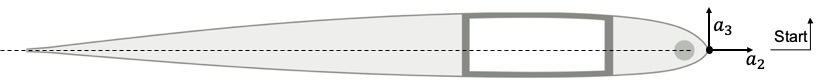

.. _sect-input-airfoil:

Cross-section Airfoil Data (``sc1095.dat``)
===========================================

In this example, the base points are supplied via a separate base points file. 
The cross section are oriented to the right and points are given in the counterclockwise direction.
This is shown in the figure below. 
The orientation of cross section and points order can also be chosen by your preference or convention.

The base points file includes arbitrary number of lines. each line includes

.. code-block::
  :linenos:

  lable a_2 a_3

The label can be any number or just strings. 
You could assign a meaningful name for important points like intersections and
assign numbers sequentially for other points.
The label will be used to reference the points in building the cross section.

.. code-block::
  :caption: sc1095.dat
  :name: code-cs_airfoil
  :linenos:

  1  0  0
  2  -0.000102  0.001466
  3  -0.000813  0.003959
  4  -0.002034  0.006255
  5  -0.004067  0.009133
  6  -0.006609  0.012145
  7  -0.009151  0.014727
  8  -0.012201  0.017476
  9  -0.018302  0.022201
  10  -0.024403  0.026083
  11  -0.030503  0.029338
  12  -0.036604  0.032084
  13  -0.042705  0.034427
  14  -0.050839  0.037069
  15  -0.061007  0.039788
  16  -0.071174  0.042051
  17  -0.081342  0.043977
  18  -0.09151  0.045624
  19  -0.101678  0.047049
  20  -0.116929  0.048852
  21  -0.132181  0.050333
  22  -0.147433  0.051581
  23  -0.162684  0.052648
  24  -0.177936  0.05354
  25  -0.193188  0.054258
  26  -0.208439  0.054802
  27  -0.223691  0.055178
  28  -0.238943  0.055414
  29  -0.254194  0.055527
  30  -0.269446  0.05554
  31  -0.284697  0.055472
  32  -0.305033  0.055281
  33  -0.325369  0.05498
  34  -0.345704  0.054576
  35  -0.36604  0.054074
  36  -0.386375  0.053479
  37  -0.406711  0.052796
  38  -0.427046  0.052028
  39  -0.447382  0.051176
  40  -0.467717  0.050241
  41  -0.488053  0.049223
  42  -0.508388  0.048123
  43  -0.528724  0.046942
  44  -0.549059  0.045679
  45  -0.569395  0.044336
  46  -0.589731  0.042911
  47  -0.610066  0.041404
  48  -0.630402  0.039817
  49  -0.650737  0.038149
  50  -0.671073  0.036402
  51  -0.691408  0.034577
  52  -0.711744  0.032673
  53  -0.732079  0.030696
  54  -0.752415  0.028652
  55  -0.77275  0.026547
  56  -0.793086  0.024387
  57  -0.813421  0.02218
  58  -0.833757  0.01993
  59  -0.854092  0.017642
  60  -0.874428  0.01532
  61  -0.894764  0.01297
  62  -0.915099  0.010595
  63  -0.925267  0.009393
  64  -0.935435  0.008179
  65  -0.945602  0.00695
  66  -0.95577  0.005702
  67  -0.965938  0.004433
  68  -0.976106  0.003603
  69  -0.986274  0.002805
  70  -0.996441  0.002008
  71  -1  0.001729
  72  -1  -0.001729
  73  -0.996441  -0.001875
  74  -0.986274  -0.002294
  75  -0.976106  -0.002713
  76  -0.965938  -0.003131
  77  -0.95577  -0.004019
  78  -0.945602  -0.004889
  79  -0.935435  -0.005745
  80  -0.925267  -0.006589
  81  -0.915099  -0.007424
  82  -0.894764  -0.009078
  83  -0.874428  -0.010723
  84  -0.854092  -0.012355
  85  -0.833757  -0.013971
  86  -0.813421  -0.015566
  87  -0.793086  -0.017137
  88  -0.77275  -0.018679
  89  -0.752415  -0.020187
  90  -0.732079  -0.021655
  91  -0.711744  -0.023078
  92  -0.691408  -0.024452
  93  -0.671073  -0.025771
  94  -0.650737  -0.027033
  95  -0.630402  -0.028238
  96  -0.610066  -0.029384
  97  -0.589731  -0.030467
  98  -0.569395  -0.031488
  99  -0.549059  -0.032448
  100  -0.528724  -0.033347
  101  -0.508388  -0.034186
  102  -0.488053  -0.034966
  103  -0.467717  -0.035688
  104  -0.447382  -0.03635
  105  -0.427046  -0.036952
  106  -0.406711  -0.037494
  107  -0.386375  -0.037974
  108  -0.36604  -0.038392
  109  -0.345704  -0.038744
  110  -0.325369  -0.039027
  111  -0.305033  -0.039236
  112  -0.284697  -0.039368
  113  -0.269446  -0.039414
  114  -0.254194  -0.03941
  115  -0.238943  -0.039348
  116  -0.223691  -0.039225
  117  -0.208439  -0.039032
  118  -0.193188  -0.038762
  119  -0.177936  -0.038406
  120  -0.162684  -0.037948
  121  -0.147433  -0.037372
  122  -0.132181  -0.03666
  123  -0.116929  -0.035795
  124  -0.101678  -0.03476
  125  -0.09151  -0.033965
  126  -0.081342  -0.033043
  127  -0.071174  -0.031911
  128  -0.061007  -0.03048
  129  -0.050839  -0.02862
  130  -0.042705  -0.026694
  131  -0.036604  -0.024941
  132  -0.030503  -0.022933
  133  -0.024403  -0.020662
  134  -0.018302  -0.01798
  135  -0.012201  -0.014526
  136  -0.009151  -0.01236
  137  -0.006609  -0.010198
  138  -0.004067  -0.007565
  139  -0.002034  -0.005099
  140  -0.000813  -0.003219
  141  -0.000102  -0.001117
  142  0  0

