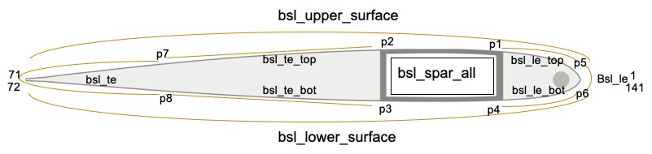

.. _sect-input-template:

Cross-section Main Input Template (``design/uh60a_section.xml.tmp``)
====================================================================

Initiation
----------

.. code-block:: xml
  :linenos:

  <cross_section name="uh60a_section" format="1">

The format 0 refers to the old format where baselines and
layups definition are given in separate files. 
The format 1 is the new format where these information are 
included in the main cross section definition file.

Include tag
-----------

.. code-block:: xml
  :linenos:

  <include>
      <material>material_database</material>
  </include>

The material database is included here. The .xml extension is omitted.

Analysis tag
------------

.. code-block:: xml
  :linenos:

  <analysis>
      <model>1</model>
  </analysis>

model 0 means classical analysis only. model 1 mean refined/Timoshenko analysis.

General settings
----------------

.. code-block:: xml
  :linenos:

  <general>
      <translate>{-1*oa2} 0</translate>
      <scale>{chord}</scale>
      <mesh_size>{mesh_size}</mesh_size>
      <element_type>linear</element_type>
  </general>

This part defines translation, scaling, rotating, global mesh size and element types. 
The transformation is done in the order of translation, scaling and rotating. 
The placeholder ``{}`` is put here for dakota to fill in with a number.

Basepoints definition
---------------------

Before we actually start definition, let's first introduce the syntax.

Syntax for basepoints
^^^^^^^^^^^^^^^^^^^^^

We can include basepoints defined in another file.

.. code-block:: xml
  :linenos:

  <basepoints>
      <include>sc1095</include>
  </basepoints>

This refers to sc1095.dat basepoints definition file. The extension is omitted here. The format
of this file is introduced in :ref:`sect-input-airfoil`.

We can also defined additonal basepoints by coordinates or by intersections.

By coordinates:

.. code-block:: xml
  :linenos:

  <point name="pnsmc">{pnsmc_a2} {pnsmc_a3}</point>

A new point is defined by x2 and x3 coordinates

By intersections:

.. code-block:: xml
  :linenos:

  <point name="p5" on="bsl_upper_surface" by="x2">-0.02</point>

The points is the intersection of the "bsl_upper_surface" and "x2=-0.02". 
This is done before any scaling, translating or rotating.

Build basepoints
^^^^^^^^^^^^^^^^

.. code-block:: xml
   :linenos:

      <point name="p1" on="bsl_upper_surface" by="x2">{wl_a2}</point>
      <point name="p2" on="bsl_upper_surface" by="x2">{wt_a2}</point>
      <point name="p3" on="bsl_lower_surface" by="x2">{wt_a2}</point>
      <point name="p4" on="bsl_lower_surface" by="x2">{wl_a2}</point>
      <point name="p5" on="bsl_upper_surface" by="x2">-0.02</point>
      <point name="p6" on="bsl_lower_surface" by="x2">-0.02</point>
      <point name="p7" on="bsl_upper_surface" by="x2">-0.8</point>
      <point name="p8" on="bsl_lower_surface" by="x2">-0.8</point>
      <point name="pnsmc">{pnsmc_a2} {pnsmc_a3}</point>

These points are as shown in :numref:`Fig. %s <fig_uh60a_baselines>`
They will help with building the baselines.

Baselines definition
--------------------

Syntax for baselines
^^^^^^^^^^^^^^^^^^^^

In this section we will introduce the syntax for defining baselines.

Define a straight baseline by a sequence of points

.. code-block:: xml
  :linenos:

  <baseline name="bsl_le" type="straight">
      <points>p6:141,1:p5</points>
  </baseline>

1 and 141 are points in the dat file. p5 and p6 are points defined by intersection.
The intersecton point can be inserted back into the dat file. When you use pA:pB, 
the points between the two points are included in the baseline.

Define a circular baseline

.. code-block:: xml
  :linenos:

  <baseline name="bsl_nsm" type="circle">
      
pnsmc

      <radius>{nsmr}</radius>
      <discrete by="angle">9</discrete>
  </baseline>

This is a circular baseline defined for the non-structural mass using a center and a radius.
The discrete tag specifies number of lines this circle is divided into.

Build baselines
^^^^^^^^^^^^^^^

Now we have all the pieces. We can start to actually build the baselines.
The baselines and base points are illustrated in the figure below. 
The point 1 is the rightmost point or starting point; 
the point 71 is leftmost point on the upper half; 
the point 72 is the leftmost point on the lower half (71 and 72 has the same x2 value); 
the point 141 is the last point before getting back to the starting point.

  Baselines and basepoints definition

1. The upper half of the airfoil

   .. code-block:: xml
     :linenos:

     <baseline name="bsl_upper_surface" type="straight">
         <points>1:71</points>
     </baseline>

2. The lower half of the airfoil

   .. code-block:: xml
     :linenos:

     <baseline name="bsl_hps" type="straight">
         <points>72:141,1</points>
     </baseline>

3. The spar box

   .. code-block:: xml
     :linenos:

     <baseline name="bsl_spar_all" type="straight">
         <points>p1:p2,p3:p4,p1</points>
     </baseline>

p1, p2, p3, p4 are defined by intersections of web locations and airfoil.

4. The leading edge

   .. code-block:: xml
     :linenos:

     <baseline name="bsl_le_top" type="straight">
         <points>p5:p1</points>
     </baseline>
     <baseline name="bsl_le" type="straight">
         <points>p6:141,1:p5</points>
     </baseline>
     <baseline name="bsl_le_bottom" type="straight">
         <points>p4:p6</points>
     </baseline>

5. The trailing edge

   .. code-block:: xml
     :linenos:

     <baseline name="bsl_te_top" type="straight">
         <points>p2:p7</points>
     </baseline>
     <baseline name="bsl_te" type="straight">
         <points>p7:71,72:p8</points>
     </baseline>
     <baseline name="bsl_te_bottom" type="straight">
         <points>p8:p3</points>
     </baseline>

The layups definition
~~~~~~~~~~~~~~~~~~~~~

.. code-block:: xml
  :linenos:

  <layup name="lyp_spar">
    <layer lamina="{mn_spar_1}">{fo_spar_1}:{np_spar_1}</layer>
    <layer lamina="{mn_spar_1}">{fo_spar_2}:{np_spar_2}</layer>
    <layer lamina="{mn_spar_1}">{fo_spar_3}:{np_spar_3}</layer>
    <layer lamina="{mn_spar_1}">{fo_spar_4}:{np_spar_4}</layer>
  </layup>

Each layup tag could include multiple layer tags. 
For each layer tag, you need to specify lamina as defined in material database, fiber orientation and number of plies.
For definition of other layups, refer to the complete input file.

The components definition
-------------------------
There are 6 components in the cross section model: the spar box, the leading edge, the trailing edge, the non-structural mass, the filling on the leading and trailing edge.

Component syntax
^^^^^^^^^^^^^^^^

.. code-block:: xml
  :linenos:

  <component name="[string]">
      <segment>
          <baseline>[string]</baseline>
          <layup>[string]</layup>
      </segment>
      </segments>
          <baseline>[string]</baseline>
          <layup (begin="[number]") (end="[number]")>[string]</layup>
          <layup>[string]</layup>
      </segments>
  </component>

You can include arbitrary number of segment/segments. 
The "segment" tag is for simple definitions. 
The "segments" tag allows you to specify multiple layups to be stacked. 
It also allows you to specify the parametric starting and end location of the layup on the baseline.

1. The spar box

   .. code-block:: xml
     :linenos:

     <component name="spar">
       <segments>
         <baseline>bsl_spar_all</baseline>
         <layup>lyp_skin_graphite</layup>
         <layup>lyp_spar</layup>
       </segments>
     </component>
   
   We use the aforementioned ``bsl_spar_all`` baseline. 
   Two layups are stacked on the baseline.

2. The leading edge

   .. code-block:: xml
     :linenos:

     <component name="le" depend="spar">
         <segments>
             <baseline>bsl_le</baseline>
             <layup>lyp_steel</layup>
             <layup>lyp_skin_graphite</layup>
             <layup>lyp_le</layup>
         </segments>
         <segments>
             <baseline>bsl_le_top</baseline>
             <layup>lyp_steel</layup>
             <layup>lyp_skin_graphite</layup>
             <layup>lyp_le</layup>
         </segments>
         <segments>
             <baseline>bsl_le_bottom</baseline>
             <layup>lyp_steel</layup>
             <layup>lyp_skin_graphite</layup>
             <layup>lyp_le</layup>
         </segments>
     </component>
   
   This component includes 3 segments. 
   They use the 3 baselines defined for leading edge. 
   The leading edge component has connection with the spar component. 
   This is indicated in the depend attribute.

3. The trailing edge
 
   .. code-block:: xml
     :linenos:

     <component name="te" depend="spar">
         <segments>
             <baseline>bsl_te_top</baseline>
             <layup>lyp_skin_graphite</layup>
             <layup>lyp_te</layup>
         </segments>
         <segment>
             <baseline>bsl_te</baseline>
             <layup>lyp_skin_graphite</layup>
         </segment>
         <segments>
             <baseline>bsl_te_bottom</baseline>
             <layup>lyp_skin_graphite</layup>
             <layup>lyp_te</layup>
         </segments>
     </component>
   
   This component also includes 3 segments. 
   The trailing edge component has connection with the spar component. 
   This is indicated in the depend attribute.

4. The non-structural mass

   .. code-block:: xml
     :linenos:

     <component name="nsm" type="fill" depend="le">
         <baseline>bsl_nsm</baseline>
         <location>pnsmc</location>
         <material>lead</material>
         <theta3>0</theta3>
         <mesh_size at="pnsmc">{mesh_size_fill}</mesh_size>
     </component>
   
   The non-structural mass is a circular area filled with a material. 
   So we specify the type to be "fill". The circular baseline bsl_nsm is used as the boundary. 
   The base point pnsmc is used to tell the program which side of the baseline is to be filled. 
   The mesh_size is to set local mesh size at the given position. 

5. The filling

   .. code-block:: xml
     :linenos:

     <component name="fill_le" type="fill" depend="spar,le,nsm">
         <location>pfle1</location>
         <material>Rohacell 70</material>
         <theta3>0</theta3>
         <mesh_size at="pfle1,pfle2">{mesh_size_fill}</mesh_size>
     </component>
     <component name="fill_te" type="fill" depend="spar,te">
         <location>pfte1</location>
         <material>Plascore PN2-3/16OX3.0</material>
         <theta3>0</theta3>
         <mesh_size at="pfte1,pfte2">{mesh_size_fill}</mesh_size>
     </component>
   
   The component is similar to the non-structural mass definition. 
   Notice that they depend on the components that they have connection with. 
   The location is to tell the where to fill the material. 
   Local mesh size control is used to refine the mesh near the specified location.

Complete file
-------------

.. code-block:: xml
  :linenos:
  
  <cross_section name="uh60a_section" format="1">
    <include>
      <material>material_database</material>
    </include>
    <analysis>
      <model>1</model>
    </analysis>
    <general>
      <translate>{-1*oa2} 0</translate>
      <scale>{chord}</scale>
      <mesh_size>{mesh_size}</mesh_size>
      <element_type>linear</element_type>
    </general>
    <baselines>
      <basepoints>
        <include>sc1095</include>
      </basepoints>
      <baseline name="bsl_upper_surface" type="straight">
        <points>1:71</points>
      </baseline>
      <baseline name="bsl_lower_surface" type="straight">
        <points>72:141,1</points>
      </baseline>
      <point name="p1" on="bsl_upper_surface" by="x2">{wl_a2}</point>
      <point name="p2" on="bsl_upper_surface" by="x2">{wt_a2}</point>
      <point name="p3" on="bsl_lower_surface" by="x2">{wt_a2}</point>
      <point name="p4" on="bsl_lower_surface" by="x2">{wl_a2}</point>
      <point name="p5" on="bsl_upper_surface" by="x2">-0.02</point>
      <point name="p6" on="bsl_lower_surface" by="x2">-0.02</point>
      <point name="p7" on="bsl_upper_surface" by="x2">-0.8</point>
      <point name="p8" on="bsl_lower_surface" by="x2">-0.8</point>
      <baseline name="bsl_spar_all" type="straight">
        <points>p1:p2,p3:p4,p1</points>
      </baseline>
      <baseline name="bsl_le_top" type="straight">
        <points>p5:p1</points>
      </baseline>
      <baseline name="bsl_le" type="straight">
        <points>p6:141,1:p5</points>
      </baseline>
      <baseline name="bsl_le_bottom" type="straight">
        <points>p4:p6</points>
      </baseline>
      <baseline name="bsl_te_top" type="straight">
        <points>p2:p7</points>
      </baseline>
      <baseline name="bsl_te" type="straight">
        <points>p7:71,72:p8</points>
      </baseline>
      <baseline name="bsl_te_bottom" type="straight">
        <points>p8:p3</points>
      </baseline>
      <point name="pnsmc">{pnsmc_a2} {pnsmc_a3}</point>
      <baseline name="bsl_nsm" type="circle">
        
pnsmc

        <radius>{nsmr}</radius>
        <discrete by="angle">9</discrete>
      </baseline>
      <!--
        The following four points are used to define locations of larger
        mesh size in the two filling regions.
      -->
      <point name="pfle1">{pnsmc_a2 - nsmr - 0.005} 0</point>
      <point name="pfle2">{wl_a2 + 0.005} 0</point>
      <point name="pfte1">{wt_a2 - 0.01} 0</point>
      <point name="pfte2">{pfte2_a2} 0</point>
    </baselines>

    <layups>
      <layup name="lyp_steel">
        <layer lamina="Aluminum 8009_0.01">0:2</layer>
      </layup>
      <layup name="lyp_skin_graphite">
        <layer lamina="T300 15k/976_0.0053">0:2</layer>
      </layup>
      <layup name="lyp_spar">
        <layer lamina="{mn_spar_1}">{fo_spar_1}:{np_spar_1}</layer>
        <layer lamina="{mn_spar_1}">{fo_spar_2}:{np_spar_2}</layer>
        <layer lamina="{mn_spar_1}">{fo_spar_3}:{np_spar_3}</layer>
        <layer lamina="{mn_spar_1}">{fo_spar_4}:{np_spar_4}</layer>
      </layup>
      <layup name="lyp_le">
        <layer lamina="{mn_le}">{fo_le}:{np_le}</layer>
      </layup>
      <layup name="lyp_te">
        <layer lamina="{mn_te}">{fo_te}:{np_te}</layer>
      </layup>
    </layups>

    <component name="spar">
      <segments>
        <baseline>bsl_spar_all</baseline>
        <layup>lyp_skin_graphite</layup>
        <layup>lyp_spar</layup>
      </segments>
    </component>
    <component name="le" depend="spar">
      <segments>
        <baseline>bsl_le</baseline>
        <layup>lyp_steel</layup>
        <layup>lyp_skin_graphite</layup>
        <layup>lyp_le</layup>
      </segments>
      <segments>
        <baseline>bsl_le_top</baseline>
        <layup>lyp_steel</layup>
        <layup>lyp_skin_graphite</layup>
        <layup>lyp_le</layup>
      </segments>
      <segments>
        <baseline>bsl_le_bottom</baseline>
        <layup>lyp_steel</layup>
        <layup>lyp_skin_graphite</layup>
        <layup>lyp_le</layup>
      </segments>
    </component>
    <component name="te" depend="spar">
      <segments>
        <baseline>bsl_te_top</baseline>
        <layup>lyp_skin_graphite</layup>
        <layup>lyp_te</layup>
      </segments>
      <segment>
        <baseline>bsl_te</baseline>
        <layup>lyp_skin_graphite</layup>
      </segment>
      <segments>
        <baseline>bsl_te_bottom</baseline>
        <layup>lyp_skin_graphite</layup>
        <layup>lyp_te</layup>
      </segments>
    </component>
    <component name="nsm" type="fill" depend="le">
      <baseline>bsl_nsm</baseline>
      <location>pnsmc</location>
      <material>lead</material>
      <theta3>0</theta3>
      <mesh_size at="pnsmc">{mesh_size_fill}</mesh_size>
    </component>
    <component name="fill_le" type="fill" depend="spar,le,nsm">
      <location>pfle1</location>
      <material>Rohacell 70</material>
      <theta3>0</theta3>
      <mesh_size at="pfle1,pfle2">{mesh_size_fill}</mesh_size>
    </component>
    <component name="fill_te" type="fill" depend="spar,te">
      <location>pfte1</location>
      <material>Plascore PN2-3/16OX3.0</material>
      <theta3>0</theta3>
      <mesh_size at="pfte1,pfte2">{mesh_size_fill}</mesh_size>
    </component>
  </cross_section>

