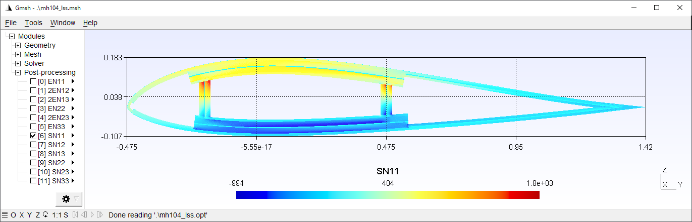

.. include:: replace.txt

.. _example-airfoil-recover:

Airfoil (Recover)
-----------------

This example continues from the  previous one to demonstrate the dehomogenization analysis. It is assumed that a 1D beam analysis has been finished, and data of global deformations and loads have been added to the main input file correctly (:ref:`See the recover section <section-recover>`). Suppose that the results in :numref:`Table %s <table_mh104_1dresults>` are used and default values are kept for others. All files generated from the VABS homogenization analysis are kept in the same place as input files. Final visualization is required and the contour plot of one of the stress components is shown in :numref:`Fig. %s <fig_mh104r>`.
Complete files can be found in ``examples\ex_airfoil_r\``, including ``mh104.xml``, ``basepoints.dat``, ``baselines.xml``, ``materials.xml``, ``layups.xml``, ``mh104_vabs.dat``, ``mh104_vabs.dat.ech``, ``mh104_vabs.dat.K``, ``mh104_vabs.dat.opt``, ``mh104_vabs.dat.v0``, ``mh104_vabs.dat.v1S``, and ``mh104_vabs.dat.v22``.

.. list-table:: Sectional forces and moments
  :name: table_mh104_1dresults
  :widths: auto
  :header-rows: 1
  :align: center

  * - Quantity
    - Value
  * - :math:`F_1`, N
    - 1
  * - :math:`F_2`, N
    - 2
  * - :math:`F_3`, N
    - 3
  * - :math:`M_1`, Nm
    - 4
  * - :math:`M_2`, Nm
    - 5
  * - :math:`M_3`, Nm
    - 6

  Contour plot of recovered nodal stress SN11.

